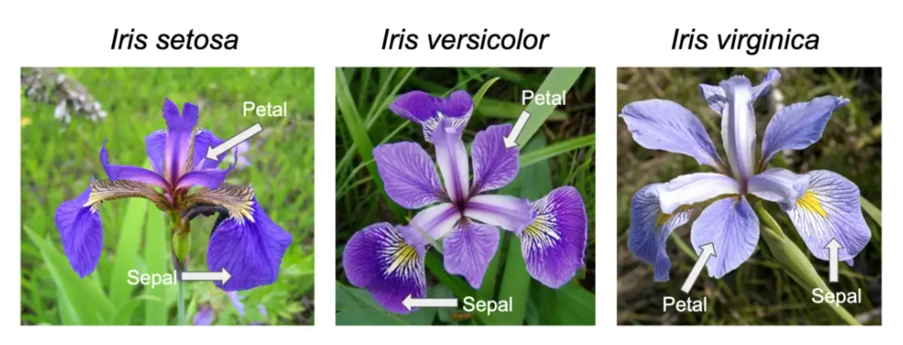

# Prediction using Unsupervised Machine Learning

This is the **second project** I completed in my internship at __TheSparksFoundation__ for the function "Data Science and Business Analytics."

## Task:
* From the given ‘Iris’ dataset, predict the optimum number of clusters and represent it visually.
* Use R or Python or perform this task
* Dataset : https://bit.ly/3kXTdox

## Solution:
To predict the optimum number of clusters from the given __'Iris'__ dataset and represent it visually, I chose the `K-means clustering` algorithm. K-means clustering is an unsupervised learning algorithm that is used to partition a dataset into a predefined number of clusters (k). It works by iteratively assigning each data point to the nearest cluster center and updating the cluster centers to be the mean of the points assigned to each cluster.

  
    <u>Image source</u>: Wikipedia

* To use K-means clustering for the *Iris dataset*, we first need to decide on the number of clusters we want to find (k). Once determined the optimal value of k, we can use the K-means algorithm to cluster the Iris dataset into k clusters. 
* To visualize the results, you can use a scatter plot to plot the data points, coloring each point according to the cluster it belongs to. This will allow us to see the clusters that the algorithm has identified and get a sense of how well the data has been partitioned.

I accomplished the project task under following steps:
## 1. Importing necessary libraries
Importing library in a Python script allows us to use the functions, classes, and other objects defined in those libraries in your code and makes it easier to accomplish tasks.

For example, I imported the Pandas library to use its data manipulation and analysis tools.

## 2. Load Dataset
Loading a dataset is an important step in the data science process because it allows you to access the data and begin working with it. There are many different ways to load a dataset, depending on where the data is stored and how it is formatted.

For example: I loaded the Iris dataset from `csv file`.

## 3. Exploratory Data Analysis (EDA)
It is a valuable tool for understanding and gaining insights from data, and uncovering any issues or anomalies. It can also be used to generate ideas for further research or to communicate findings to others.and is an important step in the data science process.

Some common techniques I used in EDA include:

* __Visualizing the data:__ Plotting the data help you get a sense of the distribution and relationships between variables. for eg: I plotted the dataset in the scatter plot for visualising the clusters of Iris species.

* __Summarizing the data:__ Calculating summary statistics such as mean, median, and standard deviation can help you get a sense of the central tendency and spread of the data.

* __Checking for missing values:__ Make sure there are no missing values in the data set, as these can cause issues with analysis and modeling.

* __Checking for outliers:__ Look for any unusual or extreme values that could be causing skews in the data.

## 4. Model building
It is the process of creating a mathematical or statistical model to represent the relationships and patterns in a dataset. Model building is a common task in data science and machine learning, as it allows you to make predictions or inferences about the data based on the patterns identified in the model.

There are many different types of models that can be built, including linear models, logistic regression models, decision trees, and neural networks. The choice of model will depend on the type of data and the specific goals of the analysis.

I used `K-means clustering` model in this project for clustering task.

It's also a good idea to repeat the clustering process multiple times with different random initializations to ensure that you are getting consistent results.

## 5. Performance evaluation
It is an important step in the model building process, as it allows you to assess the effectiveness of the model and make any necessary adjustments to improve its performance. It is also important to evaluate the performance of a model on unseen data, as this can provide a more realistic assessment of its performance on real-world tasks. 

To calculate evaluation metrics for a K-means clustering model, I performed the following:

Evaluate the quality of the clustering by computing the *within-cluster sum of squares* (WCSS). This is a measure of the compactness of the clusters, with smaller values indicating better clustering. We can also use other evaluation metrics such as *Silhouette Scores* or *Adjusted Rand index*.

Some common *performance evaluation metrics* for clustering are:
* __Inertia:__ The inertia of a K-means model is defined as the sum of the squared distances between each data point and the centroid of its assigned cluster. A lower inertia value indicates that the clusters are more compact, which is generally considered to be a good property. You can compute the inertia of a K-means model by calling the `inertia_` attribute of the model.

* __Silhouette score:__ The silhouette score is a measure of how well-separated the clusters are. It ranges from -1 to 1, with higher values indicating better separation. You can compute the silhouette score of a K-means model by using the `silhouette_score` function from `scikit-learn`.

* __Adjusted Rand index:__ The adjusted Rand index is a measure of the similarity between the cluster labels and the true labels of the data. It ranges from -1 to 1, with a value of 1 indicating perfect similarity. You can compute the adjusted Rand index of a K-means model by using the `adjusted_rand_score` function from `scikit-learn`.

* __Adjusted mutual information:__ The adjusted mutual information is a measure of the mutual information between the cluster labels and the true labels of the data, adjusted for chance. It ranges from 0 to 1, with a value of 1 indicating perfect mutual information. You can compute the adjusted mutual information of a K-means model by using the `adjusted_mutual_info_score` function from `scikit-learn`.

## 6. Making Predictions
After having trained a machine learning model, you can use it to make predictions on your own data. I did this by calling a prediction function on the model, passing in the new data as an input.

 

__Thank You and Happy Learning!__
